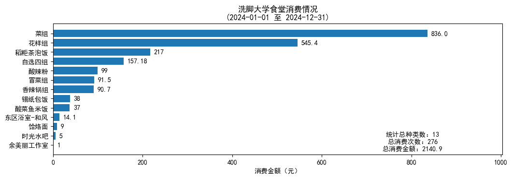
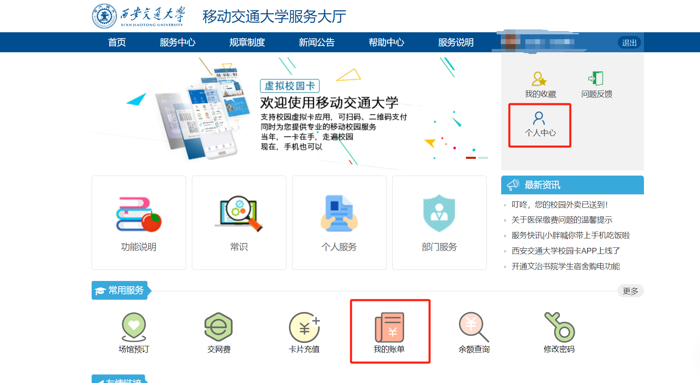
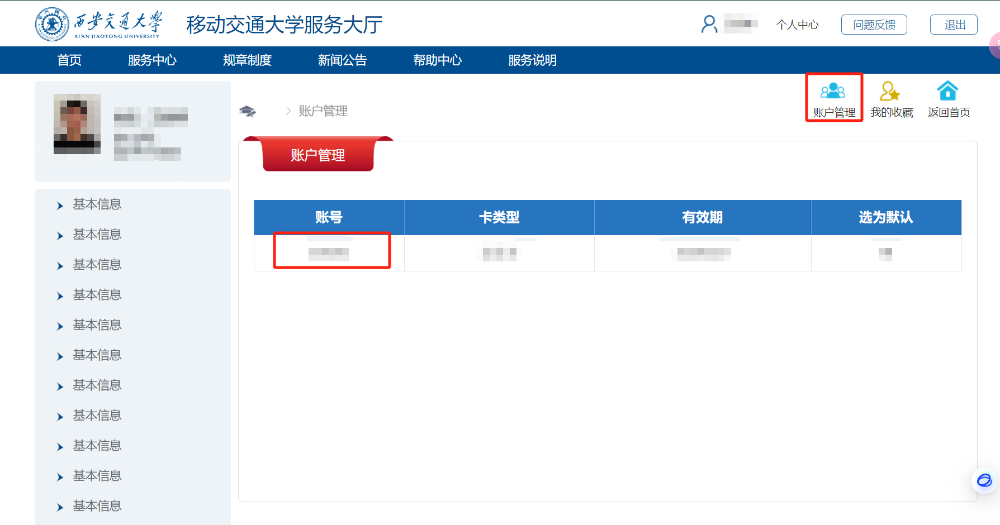
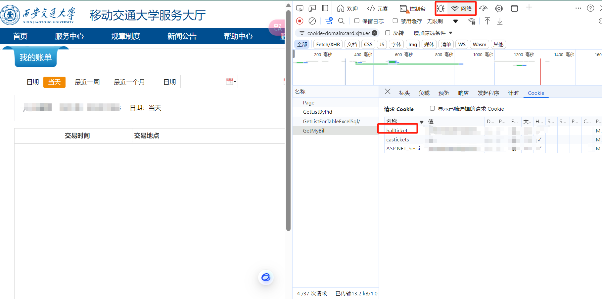

# XJTU-Annual-Eat

一年过去了，你在洗脚食堂里花的钱都花在哪儿了？

## 项目简介

> 项目的 idea 来源于 [Rose-max111](https://github.com/Rose-max111)。
> 

本项目是一个用于统计洗脚大学学生校园卡消费情况的脚本。通过模拟登录大学校园卡网站，获取学生的校园卡消费记录，并通过数据可视化的方式展示。

本项目参考[THU-Annual-Eat](https://github.com/leverimmy/THU-Annual-Eat)，感谢原作者的贡献。



## 使用方法

### 0. 获取account和hallticket

首先，登录校园卡账号后，在[洗脚大学校园卡网站](http://card.xjtu.edu.cn/User/User)获取你的`account`和`hallticket`。方法如下：



主页进入[个人中心](http://card.xjtu.edu.cn/)

点击`账号管理`，在弹出的页面中找到`账号`，复制其值。



`F12` 或者右键检查，打开开发者工具，切换到`Network`标签页，然后`Ctrl+R`刷新页面，找到 `GetMyBill` 这个请求，进入`Cookies`选项卡，复制其中`hallticket`字段的**value**，后面会用到。



### 1. 安装依赖

本项目依赖于 `requests`、`matplotlib`，请确保你的 Python 环境中已经安装了这些库。

```bash
pip install requests matplotlib
```

### 2. 运行脚本

```bash
python main.py
```

首次运行时，请输入你的`account`和`hallticket`，会自动保存在 `config.json` 文件中。

### 3. 修改配置

可以直接修改 `config.json` 文件，主要修改`account`或者`hallticket`，以及计算的起始和截止时间。

```json
{
    "account": "******",
    "hallticket": "*********",
    "sdate": "2024-01-01",
    "edate": "2024-12-31"
}
```

## LICENSE

除非另有说明，本仓库的内容采用 [CC BY-NC-SA 4.0](https://creativecommons.org/licenses/by-nc-sa/4.0/) 许可协议。在遵守许可协议的前提下，您可以自由地分享、修改本文档的内容，但不得用于商业目的。

如果您认为文档的部分内容侵犯了您的合法权益，请联系项目维护者，我们会尽快删除相关内容。
